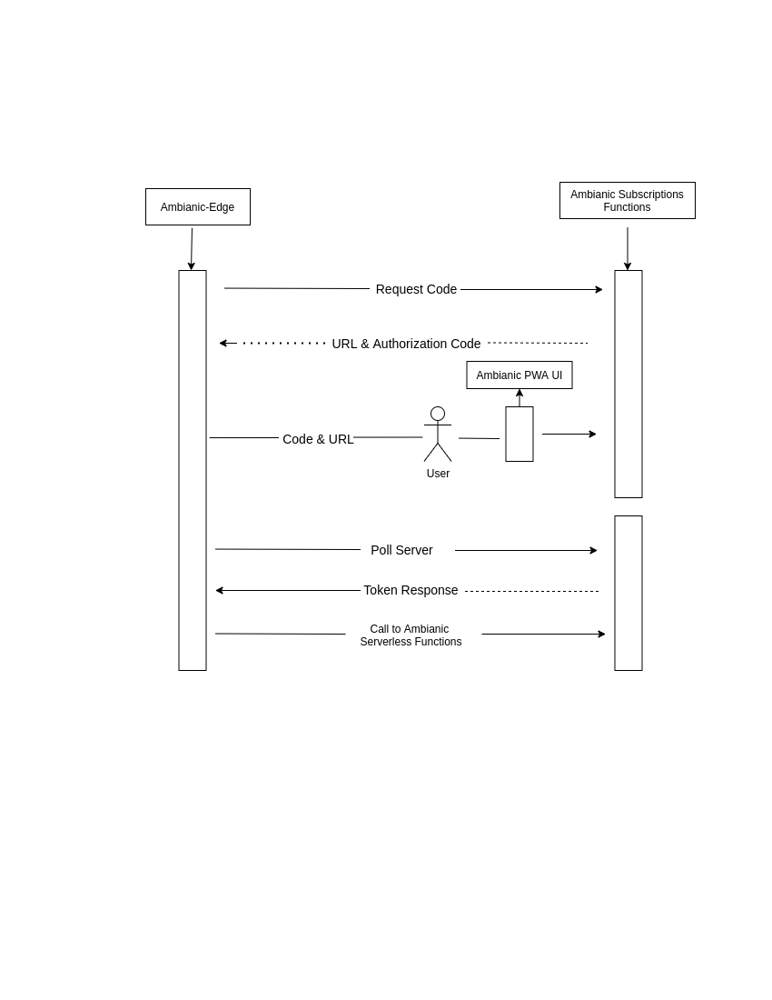

# Ambianic-subscriptions
## Repo for ambianic premium subscription management

 This repo hosts [Netlify functions](https://www.netlify.com/products/functions/) that handle Ambianic premium user subscriptions. This is code that cannot run in the browser PWA, because it needs access keys to subscription and payment gateway services (Stripe) shared between all app users. If the code runs in the PWA, users will be able to see and manipulate each other's premium subscription data 

The image below shows the architecture of these serverless functions in connection with the Ambianic [PWA](https://github.com/ambianic/ambianic-ui/).
