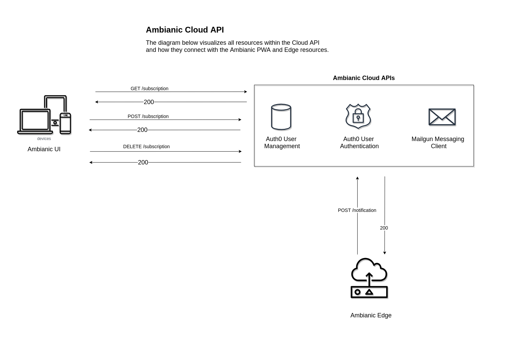

# Ambianic-subscriptions

## Repo for ambianic premium subscription management

<p> This repo hosts [Netlify functions](https://www.netlify.com/products/functions/) that handle Ambianic premium user subscriptions. This is code that cannot run in the browser PWA, because it needs access keys to subscription and payment gateway services (Stripe) shared between all app users. If the code runs in the PWA, users will be able to see and manipulate each other's premium subscription data </p>

The image below shows the architecture of these serverless functions in connection with the Ambianic [PWA](https://github.com/ambianic/ambianic-ui/) and [Edge Device](https://github.com/ambianic/ambianic-edge) .


## Running Locally

The serverless functions within this project are managed using [netlify-dev](https://www.netlify.com/products/dev/).
Start the function emulator using `yarn netlify-dev` command to handle any HTTP request made to any of the created functions on port `5050`.

Service credentials used within the serverless functions in this project are loaded as environment variables using [dotenv](https://www.npmjs.com/package/dotenv).
Before executing the `netlify dev` command, create a `.env` file in the root directory with the following values to store the needed credentials;

**Note:** It is recommended to test the Stripe integration in a test mode using [Test API Keys ](https://stripe.com/docs/keys#test-live-modes) from Stripe.

```
# Access key from Stripe to access your Stripe resources
STRIPE_KEY=STRIPE_KEY

# The ID of the email price product used in billing subscribers.
EMAIL_PRODUCT_PRICE_ID=EMAIL_PRODUCT_PRICE_ID
 
# Your Auth0 Domain
AUTHO_DOMAIN=AUTHO_DOMAIN

# Auth0 Management Application Client ID
MGT_CLIENT_ID=MGT_CLIENT_ID

# Auth0 Management Application Client Secret
MGT_CLIENT_SECRET=MGT_CLIENT_SECRET

# Email SMTP host
SMTP_HOST=SMTP_HOST

# Email SMTP Password
SMTP_PASSWORD=SMTP_PASSWORD

# Email Sender Address
SMTP_SENDER=SMTP_SENDER

# Email SMTP Username
SMTP_USERNAME=SMTP_USERNAME
```

## CI / CD Pipeline

All serverless function endpoints within this Cloud API all tested using [Postman Tests](https://www.postman.com/automated-testing/). The API documentation explaining the endpoints can be found in the GitHub pages for this repository [here](https://ambianic.github.io/ambianic-subscriptions.github.io/). An exported file of the postman collection in json format is available at `./tests/postman/ambianic-functions-collection.postman_collection.json`.

Continuous integration for this project is managed using [GitHub Actions](https://github.com/features/actions), driven using the steps in the `.github/workflows/ci.yaml` file.
The following sensitive credentials are used within the CI jobs are stored using [Github Secrets](https://docs.github.com/en/actions/reference/encrypted-secrets) and are retrieved and used within each workflow build;

- GITHUB_TOKEN
- NPM_TOKEN
- REPOSITORY_ACCESS_TOKEN

## Cloud Deployment
All serverless functions within this project were designed to be deployed and executed as [Netlify Functions](https://www.netlify.com/products/functions/).
The following environment variables used within the serverless functions, and should be added in your application's [Build Environment Variables](https://docs.netlify.com/configure-builds/environment-variables/) when the project is deployed to [Netlify](https://www.netlify.com).

```
# Access key from Stripe to access your Stripe resources
STRIPE_KEY=STRIPE_KEY

# The ID of the email price product used in billing subscribers.
EMAIL_PRODUCT_PRICE_ID=EMAIL_PRODUCT_PRICE_ID

# Your Auth0 Domain
AUTHO_DOMAIN=AUTHO_DOMAIN

# Auth0 Management Application Client ID
MGT_CLIENT_ID=MGT_CLIENT_ID

# Auth0 Management Application Client Secret
MGT_CLIENT_SECRET=MGT_CLIENT_SECRET

# Email SMTP host
SMTP_HOST=SMTP_HOST

# Email SMTP Password
SMTP_PASSWORD=SMTP_PASSWORD

# Email Sender Address
SMTP_SENDER=SMTP_SENDER

# Email SMTP Username
SMTP_USERNAME=SMTP_USERNAME
```